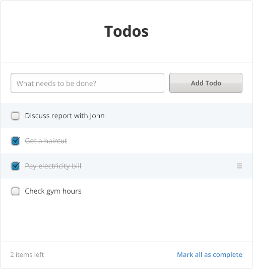

# Tictail Hack V 2.2

## The mission
To build a todo application according to the attached PSD with corresponding API backend.


## Client Side Libraries
We'd __love__ to see that the client application uses React <http://facebook.github.io/react/> or equivalent. As long as you can motivate your choice of frameworks we're fine with it.

Feel free to throw in any other libraries that you like.

## API and backend
The client application should communicate with a suitable API, preferably following a REST architecture.

On the backend side, we'd like to see Flask <http://flask.pocoo.org/> or equivalent Python web framework.

## Functionality
It's up to you to set the scope of the assessment and motivate your design choices.

* An application designed according to the attached PSD
* Understand the design and implement features and interactions accordingly
* Implements a clear and concise API


## Delivery
The application should be delivered as a ```git``` repository, preferably hosted on GitHub <https://github.com/>.

## Follow up
During the follow up interview we'll go through the different aspects of the application and discuss

* Client side application structure and used libraries and their behavior and implementation
* Look and feel of client side application
* Server side application structure and frameworks
* API design
* Design choices and their advantages and disadvantages
